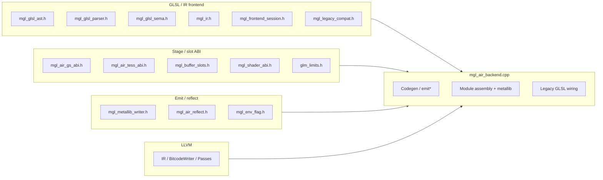
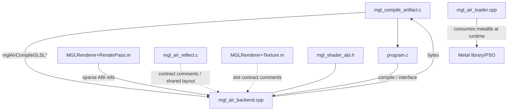
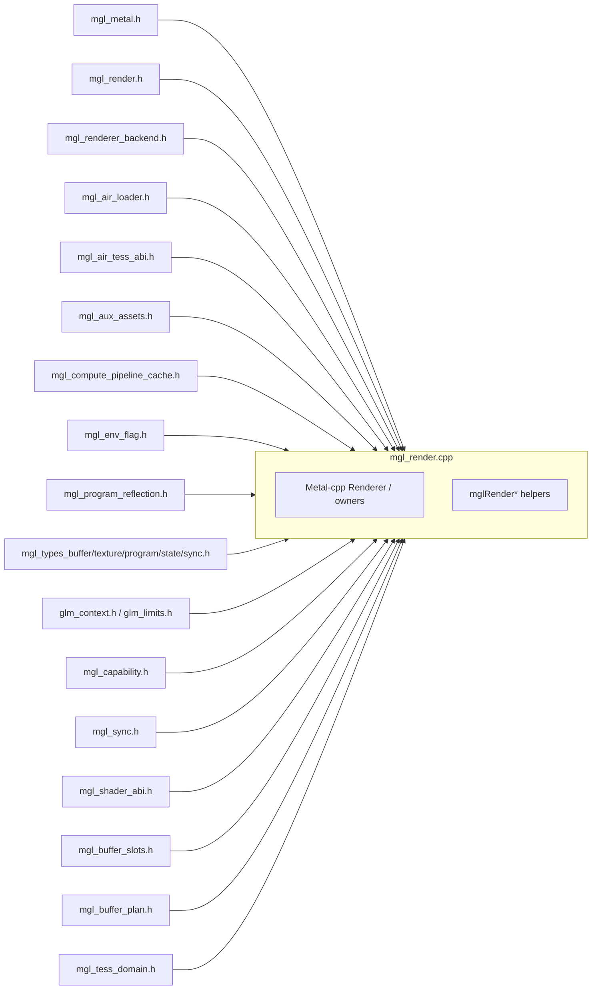
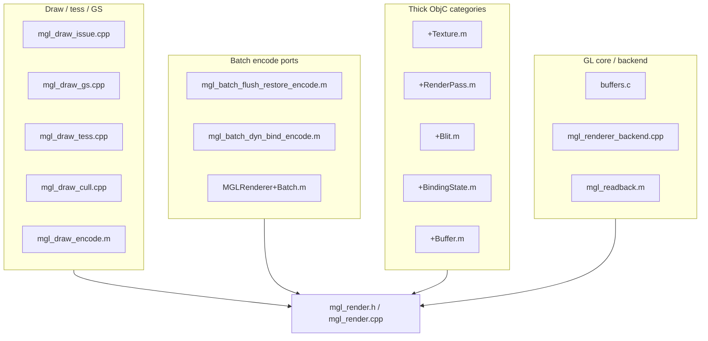
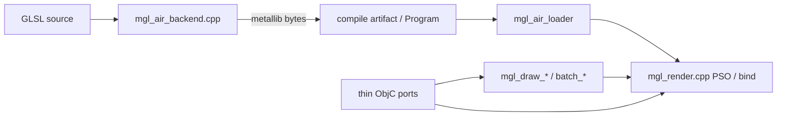

# C0 — Dependency map: `mgl_air_backend.cpp` & `mgl_render.cpp`

> Track **C0** was docs-only; **C1** started monolith knives (IntegerReadback out).
> Snapshot: `main` @ C1g air stmt emit (~13.8k air / ~20.5k render LOC). Re-measure with `wc -l` after splits.
> Purpose: make include / caller / domain boundaries visible before any TU knife.

---

## 0. Why these two

| TU | ~LOC | Role | Risk if sink blindly |
|----|-----:|------|----------------------|
| `MGL/src/mgl_air_backend.cpp` | ~13762 | GLSL AST → LLVM AIR → `.metallib` | Mixes expr emit, stage ABI, legacy rewrite, reflect helpers; **type (C1b) + resource (C1c) + math (C1d) + VarSym (C1e) + matrix builtins (C1f) + stmt emit (C1g) extracted** |
| `MGL/src/mgl_render.cpp` | ~20470 | Metal-cpp runtime + ~800 `mglRender*` C ABI helpers | Catch-all for plans that belong in domain files (`mgl_buffer_plan`, tess, readback, …) |

Policy (OBJC TODO / ARCH): **do not grow these**; new sinks land in domain TUs.

---

## 1. `mgl_air_backend.cpp`

### 1.1 Includes (project)



Also pulls standard C++ STL (`map` / `vector` / `string` / …).

### 1.2 Internal domains (section banners)

Anonymous `namespace { … }` holds almost all helpers; C API is `extern "C"` after close.

| Approx lines | Banner / domain |
|-------------:|-----------------|
| ~87–185 | GS AST→ABI map; C1b/C1c/C1d/C1e/C1f/C1g facades; `storeStageOut` |
| ~~bootstrap + type helpers~~ | **C1b extracted** → `mgl_air_type.{h,cpp}` + `mgl_air_codegen.h` (`MType`/`Codegen`/carriers/LLVM/mangle/`typeFromIR`) |
| ~~resource collection~~ | **C1c extracted** → `mgl_air_resource.{h,cpp}` (`uniformBlock*` / `collectUniforms` / opaque leaves / sampler path) |
| ~162–… | **expression codegen** (`findSymbol` / swizzle / … → emitExpr) |
| ~~matrix builtins~~ | **C1f extracted** → `mgl_air_matrix.{h,cpp}` (`emitMatrixBuiltin` / `emitMatrixBinOp` + det helpers; thin `AirMatrixDeps` facade); emitExpr still deferred |
| … | **uniform-block member chains** / related stores |
| ~~math builtins~~ | **C1d extracted** → `mgl_air_math.{h,cpp}` (`emitMathBuiltin` + float-intrinsic helpers; thin `AirMathDeps` facade) |
| ~~statements~~ | **C1g extracted** → `mgl_air_stmt.{h,cpp}` (`emitStmt` / `emitCompound` + break/continue scan; thin `AirStmtDeps` facade); emitExpr still deferred |
| … | **AIR metadata** (`addModuleFlags`) |
| ~~module-assembly VarSym classify/location~~ | **C1e extracted** → `mgl_air_varsym.{h,cpp}` (`collectStageVarSyms` / `assignStageVarSymLocations` / `varyingLocationSpan` / attrib / stride); residual module assembly + compileGLSLImpl remain |
| … | **legacy GLSL wiring** + `compileGLSLImpl` |
| …–EOF | **exported C ABI** (compile / reflect / interface check) |

### 1.3 Exported C API (`mgl_shader_abi.h`)

| Symbol | Role |
|--------|------|
| `mglShaderCompileGLSL` | Stage metallib compile |
| `mglShaderCompileGLSLCapture` | VS XFB capture variant |
| `mglShaderCompileGLSLTessCapture` | VS tess-capture variant |
| `mglShaderCompileGLSLCullDistanceCapture` | VS cull-distance capture |
| `mglAirReflectGLSLStageInfo` | Stage metadata fill |
| `mglAirCompileGLSLWithReflectInfo(Ex)` | Compile + reflect lists + stage info |
| `mglAirCompileGLSLWithReflect` | Compile + reflect |
| `mglShaderFree` | Free metallib bytes |
| `mglShaderInterfaceCheck` | VS/FS link interface |
| `mglShaderTessInterfaceCheck` | TCS/TES link interface |

Pipeline (conceptual):

```text
GLSL source
  → mglFrontendRewriteLegacy (optional)
  → FrontendSession (parse + sema → TU + IR)
  → compileGLSLImpl (emitExpr/Stmt → LLVM Module + air.* meta)
  → metallib writer → bytes
  → (optional) mglAirReflect* / stage info
```

### 1.4 Callers / siblings (do not edit in C0)



`mgl_air_loader.*` is the **runtime** loader (not this TU); keep split when planning knives.

---

## 2. `mgl_render.cpp`

### 2.1 Includes (project)



ObjC runtime / Mach / Block headers are also included for Metal object class probes.

### 2.2 Domain clusters (by `mglRender*` line bands)

~805 exported `mglRender*` symbols live in this one TU. Coarse map for future split (not a prescription of PR order):

| Approx lines | Domain cluster | Examples |
|-------------:|----------------|----------|
| ~100–1470 | Metal-cpp internals / pass & PSO state types | `namespace mgl`, anonymous helpers |
| ~1448–1600 | Init / capability / AIR load entry | `mglRenderInit`, `LoadAIRMainFunction` |
| ~1600–2900 | Buffer storage / CoW / dirty / map / flush | `BindBufferStorage`, `SnapshotShared*` |
| ~2896–3280 | Program bind / sync / flush / query | `BindAIRProgram`, timer/sample query |
| ~3280–3800 | Buffer/texture create & views | `CreateTexture*`, `CreateBuffer*` |
| ~3808–6700 | Texture upload / format / readback copy | `TextureSubUploadPlan`, `Copy*ToGL` |
| ~6638–7200 | Stage binding / tess factor helpers | `EncodeStageBindingCopyBacks`, tess factor |
| ~~7238–7549~~ | ~~Integer readback classify~~ | **C1 extracted** → `mgl_readback_policy.{h,c}` (`Convert` + `Source`/`Packed`/`Classify`) |
| ~~CopyRows / depth / GetTexImagePlan / MSAA stride~~ | ~~Y-flip / depth pack / plan~~ | **C1 extracted** → same TU; Metal `EncodeMultisampleResolve*` residual in monolith |
| ~7550–8500 | Binding policy / residual near former readback | sampler/slot maps |
| ~8509–9400 | PSO / pass / blend / stencil / viewport | `PipelinePass*`, `Blend*FromGL` |
| ~9400–11200 | Format tables / clear mask / UBO pack | pixel-format class, plain-uniform pack |
| ~11214–12000 | Index expand / gather / blit plan | fan/strip/quad expand, `BlitFramebufferPlan` |
| ~12001–13600 | Tess / XFB size / texture swizzle bake | `SeedTessDomain`, swizzle upload bake |
| ~13597–15055 | Sampler / depth-stencil create + aux PSO | `CreateSampler*`, aux library cache |
| ~15056–17045 | Binding-state apply / masks | texture/buffer slot record |
| ~17046–20265 | Command recovery / encoder owners | recovery snapshot / reset |
| ~20266–EOF | Batch replay draw cmds | `mglRenderReplayBatchDraws` |

Anonymous `namespace` reopen points (~112, ~3004, ~15056, ~15537, ~17046, ~20266) roughly track these clusters.

### 2.3 Callers (include of `mgl_render.h`)

~50 TUs include `mgl_render.h`. Representative edges:



Full include list is discoverable with:

```bash
rg -l '#include "mgl_render.h"' MGL/
```

### 2.4 Already-extracted neighbors (do not re-merge)

Prefer extending these instead of growing `mgl_render.cpp`:

- `mgl_buffer_plan.*`, `mgl_render_pass_plan.*`, `mgl_tess_domain.*`
- `mgl_readback_policy.*` (**C1** — IntegerReadback + Y-flip/depth/GetTexImagePlan/MSAA stride)
- `mgl_air_type.*` + `mgl_air_codegen.h` (**C1b** — MType / type helpers; not emitExpr)
- `mgl_air_resource.*` (**C1c** — uniform/opaque resource collection)
- `mgl_air_math.*` (**C1d** — math/pack/bitfield builtins; not emitExpr/matrix)
- `mgl_air_varsym.*` (**C1e** — VarSym stage classify / location assign / stride; not emitExpr/matrix)
- `mgl_air_matrix.*` (**C1f** — matrix builtins/binops; not whole emitExpr)
- `mgl_air_stmt.*` (**C1g** — emitStmt/compound; not whole emitExpr)
- `mgl_draw_{issue,gs,tess,cull,gs_metal}.*`
- `mgl_batch_{path,hazard,replay,restore,issue,rt_mark}.*`
- `mgl_compute_pipeline_cache.*`, `mgl_renderer_backend.*`

---

## 3. Cross-TU relationship (high level)



`mgl_air_backend.cpp` and `mgl_render.cpp` share **ABI headers** (`mgl_shader_abi`, tess/GS ABI, buffer slots) but should **not** call into each other directly; the seam is metallib bytes + stage info + loader.


---

## 4. C1 knife log — readback_policy (O4.1)

Chose **render readback policy → `mgl_readback_policy.*`** (DXMT / O4.1) over air type/expr (**C1b**): pure `extern "C"` helpers with no `Codegen` / Metal-cpp owner coupling; air type+expr is tangled through `emitExpr` / `MType` across multi-kLOC.

### 4.1 First strip — IntegerReadback

| Item | Detail |
|------|--------|
| Moved | `mglRenderConvertIntegerReadback`, `mglRenderIntegerReadbackSourceClassify`, `mglRenderIntegerReadbackPackedTypeClassify`, `mglRenderIntegerReadbackClassify` |
| New files | `MGL/include/mgl_readback_policy.h`, `MGL/src/mgl_readback_policy.c` |
| Monolith | bodies removed; `mgl_render.h` includes the domain header (Texture.m call sites unchanged) |
| Build | `Makefile` wildcard `*.c` picks up the TU; `test_metalcpp_smoke` explicit list updated |
| Pixel format | domain TU uses `MGLPixelFormat` numeric ABI (no metal-cpp) |
| LOC | `mgl_render.cpp` ~21043→~20599 (−444) |

### 4.2 Second strip — Y-flip / MSAA stride / depth pack / GetTexImagePlan

| Item | Detail |
|------|--------|
| Moved | `mglRenderCopyRows`, `mglRenderCopyDepthTextureBytesToFloat`, `mglRenderDepthReadbackPlan`, `mglRenderTextureRepackDepthPlanes`, `mglRenderMSAAArrayLayerStride`, `mglRenderGetTexImagePlan` (+ `MGLRenderGetTexImagePlan`) |
| Residual (Metal) | `mglRenderEncodeMultisampleResolve*` stays in `mgl_render.cpp` / ObjC ports — not a pure policy table |
| Not moved | format-convert loops that merely take `flip_y` (`Copy*TextureBytesToGL`, BGRA8 paths) — still entangled with decode tables in the monolith |
| LOC | `mgl_render.cpp` ~20599→~20470 (−129); `mgl_readback_policy.c` ~468→~606; header ~126→~196 |

**Next strip suggestion (render):** Optional later flip-aware format convert into `mgl_readback_policy` only if a clean boundary appears; do not sink back into `mgl_render.cpp`. **C1b (air type helpers) done** — see §4b.


---

## 4b. C1b knife log — air type helpers

Chose **air type helpers → `mgl_air_type.*` + `mgl_air_codegen.h`** (DXMT C1b). Narrow strip: former ~290–723 band (+ `typeFromIR`); **not** emitExpr / matrix builtins.

| Item | Detail |
|------|--------|
| Moved | `MType`; carrier predicates/encode/decode; `llvmScalar`/`llvmType`/`llvmTypeFromIR`; `coerceScalar`; array-mem helpers; AIR/MSL mangling; `varyingIfaceTag`; `typeFromIR` |
| Shared state | `Uniform` / `VarSym` / `LoopCtx` / `BreakCtx` / `Codegen` → `mgl_air_codegen.h` (backend-internal; required so type TU can see `Codegen&`) |
| Residual in monolith | `storeStageOut` (stage-out side effect); ~~resource collection~~ → **C1c**; emitExpr / matrix / stmt / legacy |
| New files | `MGL/include/mgl_air_type.h`, `MGL/src/mgl_air_type.cpp`, `MGL/include/mgl_air_codegen.h` |
| Monolith | bodies removed; anon-ns `using mgl::air::*` facade |
| Build | `Makefile` wildcard `*.cpp` picks up TU; explicit `test_mglair` / `test_mcrepro` / `test_mglair_gtest` lists updated |
| LOC | `mgl_air_backend.cpp` ~16905→~16302 (−603); new `mgl_air_type.cpp` ~484 |
| Golden | `test_mgl_air_type` — non-Metal carrier/mangle/`typeFromIR` (LLVM+ir only; no Codegen emit, no Metal) |

**Next strip suggestion:** ~~math builtins~~ → **C1d done** (§4d). Further: module-assembly VarSym / later expr facade — keep emitExpr/matrix deferred.

---

## 4c. C1c knife log — air resource collection

Chose **air resource collection → `mgl_air_resource.*`** (DXMT C1c). Banner strip: former ~152–306 (`uniformBlock*` / `collectUniforms` / `appendOpaqueUniformLeaves` / `resolveSamplerAccessName`); **not** emitExpr / matrix / module-assembly VarSym loop.

| Item | Detail |
|------|--------|
| Moved | `uniformBlockType`, `uniformBlockElementCount`, `uniformBlockIsInstanceArray`, `collectUniforms`, `appendOpaqueUniformLeaves`, `resolveSamplerAccessName` |
| Shared state | Uses `Uniform` / `VarSym` / `typeFromIR` via `mgl_air_codegen.h` + `mgl_air_type.h` |
| Residual in monolith | Module-assembly stage VarSym classify + location assign; emitExpr / matrix / stmt / legacy |
| New files | `MGL/include/mgl_air_resource.h`, `MGL/src/mgl_air_resource.cpp` |
| Monolith | bodies removed; anon-ns `using mgl::air::*` facade |
| Build | `Makefile` wildcard `*.cpp` picks up TU; explicit `test_mglair` / `test_mcrepro` / `test_mglair_gtest` lists updated |
| LOC | `mgl_air_backend.cpp` ~16302→~16157 (−145); new `mgl_air_resource.cpp` ~173 |

**Next strip suggestion:** ~~math builtins~~ → **C1d done** — see §4d.

---

## 4d. C1d knife log — air math builtins

Chose **air math builtins → `mgl_air_math.*`** (DXMT C1d). Coherent strip: `emitMathBuiltin` (+ `callFloatIntrinsic` / `fpConstOf` / `typeIsIntLike`); **not** emitExpr / matrix builtins.

| Item | Detail |
|------|--------|
| Moved | `emitMathBuiltin` (trig/exp/rounding/geometric/pack/bitfield); float-intrinsic helpers |
| Shared state | `AirMathDeps` hooks into monolith `emitExpr` / `callAirFn` / `dotProduct` / `broadcastTo` / `exprType` / SSBO lvalue path — backend keeps thin static facade |
| Residual in monolith | emitExpr / matrix / stmt / ~~module-assembly VarSym~~ → **C1e**; legacy |
| New files | `MGL/include/mgl_air_math.h`, `MGL/src/mgl_air_math.cpp` |
| Monolith | body removed; anon-ns static `emitMathBuiltin` → `mgl::air::emitMathBuiltin` + `AirMathDeps` |
| Build | `Makefile` wildcard `*.cpp` picks up TU; explicit `test_mglair` / `test_mcrepro` / `test_mglair_gtest` lists updated |
| LOC | `mgl_air_backend.cpp` ~16157→~15216 (−941); new `mgl_air_math.cpp` ~1009 |

**Next strip suggestion:** ~~module-assembly VarSym~~ → **C1e done** (§4e). Later expr facade — still defer emitExpr/matrix bodies. Do **not** sink back into `mgl_air_backend.cpp`.

---


---

## 4e. C1e knife log — air VarSym classify / location

Chose **module-assembly VarSym classify/location → `mgl_air_varsym.*`** (DXMT C1e). Coherent strip: `collectStageVarSyms` + `assignStageVarSymLocations` + `varyingLocationSpan` / `airAttribLocation` / `stageRecordStride`; **not** emitExpr / matrix / emitStmt.

| Item | Detail |
|------|--------|
| Moved | Stage VarSym classify from IR symbols; input/output/patch location assign (+ attrib preference + iface peer remap); location span; record/patch stride helpers |
| Shared state | Uses `typeFromIR` / `appendOpaqueUniformLeaves` via `mgl_air_type` + `mgl_air_resource`; thin `AirIfaceLocationPeer` avoids Mach/GL in the new TU |
| Residual in monolith | emitExpr / ~~matrix~~ → **C1f**; stmt / remaining module assembly + legacy `compileGLSLImpl` |
| New files | `MGL/include/mgl_air_varsym.h`, `MGL/src/mgl_air_varsym.cpp` |
| Monolith | bodies removed; `using mgl::air::*` facade + call site in `compileGLSLImpl` |
| Build | `Makefile` wildcard `*.cpp` picks up TU; explicit `test_mglair` / `test_mcrepro` / `test_mglair_gtest` lists updated |
| LOC | `mgl_air_backend.cpp` ~15216→~14998 (−223); new `mgl_air_varsym.cpp` ~312; air TU now &lt;15k |

**Next strip suggestion:** ~~matrix builtins~~ → **C1f done** (§4f). ~~stmt strip~~ → **C1g done** (§4g). Later expr facade (still defer whole emitExpr). Do **not** sink back into `mgl_air_backend.cpp`.


---

## 4f. C1f knife log — air matrix builtins

Chose **air matrix builtins → `mgl_air_matrix.*`** (DXMT C1f). Coherent strip: `emitMatrixBuiltin` / `emitMatrixBinOp` (+ `det2Sel` / `det3Sel` / `detMatrix`); **not** whole emitExpr.

| Item | Detail |
|------|--------|
| Moved | `emitMatrixBuiltin` (transpose/matrixCompMult/outerProduct/determinant/inverse); `emitMatrixBinOp` (M*vec/vec*M/M*M/M±scalar/M==); det helpers |
| Shared state | `AirMatrixDeps` hooks into monolith `emitExpr` / `dotProduct` / `scalarizeBoolCompare` — backend keeps thin static facade |
| Residual in monolith | emitExpr / ~~stmt~~ → **C1g**; remaining module assembly + legacy `compileGLSLImpl` |
| New files | `MGL/include/mgl_air_matrix.h`, `MGL/src/mgl_air_matrix.cpp` |
| Monolith | bodies removed; anon-ns static `emitMatrixBuiltin` / `emitMatrixBinOp` → `mgl::air::*` + `AirMatrixDeps` |
| Build | `Makefile` wildcard `*.cpp` picks up TU; explicit `test_mglair` / `test_mcrepro` / `test_mglair_gtest` lists updated |
| LOC | `mgl_air_backend.cpp` ~14998→~14594 (−404); new `mgl_air_matrix.cpp` ~453 |

**Next strip suggestion:** ~~stmt strip~~ → **C1g done** (§4g). Later expr facade (still defer whole emitExpr body). Do **not** sink back into `mgl_air_backend.cpp`. Parallel: Batch honest cluster still ~1923; `mgl_render` ~20.5k — not claimed done.

---

## 4g. C1g knife log — air statement emit

Chose **air statement emit → `mgl_air_stmt.*`** (DXMT C1g). Coherent strip: `emitStmt` / `emitCompound` (+ `stmtContainsBreakOrContinue`); **not** whole emitExpr / assembleReturn.

| Item | Detail |
|------|--------|
| Moved | `emitStmt` (compound/expr/decl/return/discard/if/for/while/do-while/switch/break/continue); `emitCompound`; `stmtContainsBreakOrContinue` |
| Shared state | `AirStmtDeps` hooks into monolith `emitExpr` / `exprType` / `assembleReturn` / `cloneIRType` — backend keeps thin static facade |
| Residual in monolith | emitExpr / remaining module assembly + legacy `compileGLSLImpl` / stage-return assembly |
| New files | `MGL/include/mgl_air_stmt.h`, `MGL/src/mgl_air_stmt.cpp` |
| Monolith | bodies removed; anon-ns `emitStmt` → `mgl::air::emitStmt` + `AirStmtDeps` |
| Build | `Makefile` wildcard `*.cpp` picks up TU; explicit `test_mglair` / `test_mcrepro` / `test_mglair_gtest` lists updated |
| LOC | `mgl_air_backend.cpp` ~14594→~13762 (−832); new `mgl_air_stmt.cpp` ~890 |

**Next strip suggestion:** later expr facade (still defer whole emitExpr body), or remaining module-assembly residual. Do **not** sink back into `mgl_air_backend.cpp`. Parallel: Batch honest cluster still ~1923; `mgl_render` ~20.5k — not claimed done.

## 5. C0 / C1 exit criteria

- [x] Includes / callers / domains documented for **only** these two TUs
- [x] C0 itself: no monolith edits (docs-only)
- [x] **C1** (first knife): IntegerReadback → `mgl_readback_policy.{h,c}`; `mgl_render.cpp` ~21043→~20599 (−444)
- [x] **C1** (O4.1 residual knife): Y-flip / depth pack / GetTexImagePlan / MSAA stride → same TU; `mgl_render.cpp` ~20599→~20470 (−129); Metal MSAA encode residual documented
- [x] **C1b** (air type helpers): `MType`/carriers/LLVM/mangle/`typeFromIR` → `mgl_air_type.*` + `mgl_air_codegen.h`; `mgl_air_backend.cpp` ~16905→~16302 (−603); emitExpr/matrix deferred; non-Metal golden `test_mgl_air_type`
- [x] **C1c** (air resource collection): `uniformBlock*`/`collectUniforms`/opaque leaves/sampler path → `mgl_air_resource.*`; `mgl_air_backend.cpp` ~16302→~16157 (−145); emitExpr/matrix deferred
- [x] **C1d** (air math builtins): `emitMathBuiltin` → `mgl_air_math.*`; `mgl_air_backend.cpp` ~16157→~15216 (−941); emitExpr/matrix deferred; Linux smoke `mgl_air_math.cpp` + llvm-19
- [x] **C1e** (air VarSym classify/location): → `mgl_air_varsym.*`; `mgl_air_backend.cpp` ~15216→~14998 (−223); air TU &lt;15k; emitExpr/matrix deferred; Linux smoke `mgl_air_varsym.cpp` + llvm-19
- [x] **C1f** (air matrix builtins): `emitMatrixBuiltin`/`emitMatrixBinOp` → `mgl_air_matrix.*`; `mgl_air_backend.cpp` ~14998→~14594 (−404); emitExpr deferred; Linux smoke `mgl_air_matrix.cpp` + llvm-19
- [x] **C1g** (air statement emit): `emitStmt`/`emitCompound` → `mgl_air_stmt.*`; `mgl_air_backend.cpp` ~14594→~13762 (−832); emitExpr deferred; Linux smoke `mgl_air_stmt.cpp` + llvm-19
- [ ] Future knives: continue by domain table (later expr facade, or binding-policy residual); keep golden before large moves (ARCH); do not re-enable CI until Paravirt sorted

